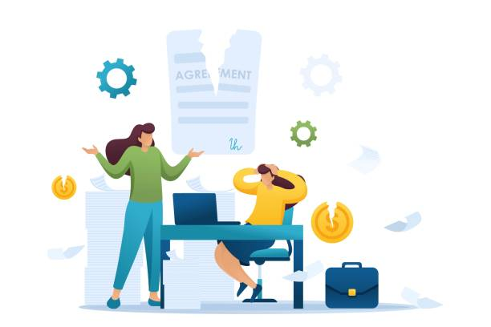
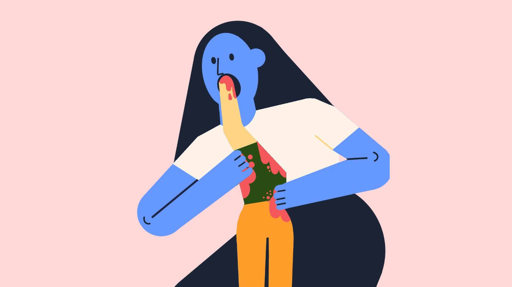
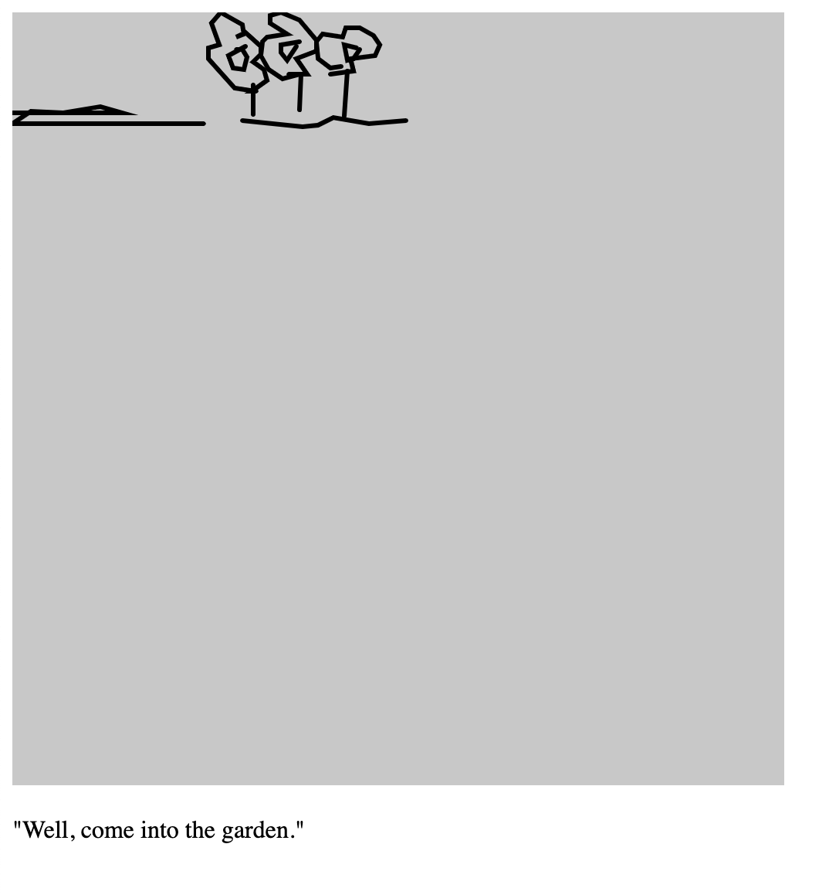

# A2Z_final

Research of illustrations systems

For my final project, I wanted to take what I learned from this class and combine it with my work outside of it.

I work as an illustrator, and I enjoyed exploring rita and the way it made me think about language. The way computer analyze text is by classification- nouns, verbs, etc. I was wondering how I can create computational illustrations that behave in the way rita constract sentences.

Illustration, however, is all about the subtext. right?

**Corporate Memphis**

Another point of interst for me is what is called "Corporate Memphis". In 2017 Facebook released an illustration system called "Allegria" that had is constracted from rules and parts, and the rest of the tech industry followed suit. The style work for cheap illustrations as well, since you can build it very easly by combining and merging differnt stock illustrations. According to wikipedia "The style has since been criticized for being generic,[5] overused, and attempting to sanitize public perception by presenting human interaction in utopian optimism.[1] Illustrators working in this style refer to it as flat art.[3] It is also known as the Alegria style,[1] Big Tech art style[6], Corporate art style, and Humans of Flat[1]."

For example, what the hell are the people in this illustration are doing?

From my work experience in tech- I know excactly how this kind of things happen, and I had my part in creating them. They are (or are they?) inclusive, fast to create, and good for making scary terms like "big data" seem cute. But this is how I feel about it this days:

Latley this idea has been taking in to even more extreme, as microsoft realsed to office word a system in which the user can create illustrations using smaller and smaller component. The user, in my view, is expected to behave like an algorithm.

**02: exploration**

I decided I want to take microsoft concept or illustration system to extreme. I wanted to use the data set of google "quick draw" becouse it is the farest I felt I could go style wise from the flat smooth coaporate tech style. And for text used the book Anna Karnina, just becouse I love the book and I think it has beutiful sentences. I also worked with it before so it made things a bit easier for me.

I already had a script looking for sentences with specific words from my midterm (in which I made a twitter bot that twitted all the sentences with the word Anna with them). Using my professor Daniel Shiffman's taturial about Quick Draw I was able to create another script that pull off all of the drawings of the word garden.

With some help from my friend David Curry I was able to connect this two scripts and combining all the sentences with the word garden in them into the garden drawings, and I was pleased with this first expirement.

**03: Design**

After recieving feedback on user testing in class, I decided to spend some time on design.
I wanted to make the drawing feels human, so I decided to make a brush to draw the point. I love the look of ink so that was the direction I was going for.
I found this sketch by

<iframe src="https://editor.p5js.org/AhmadMoussa/full/UEkATscAg"></iframe>
